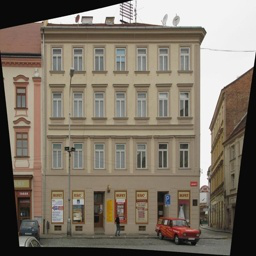
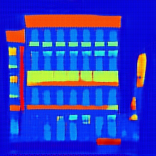
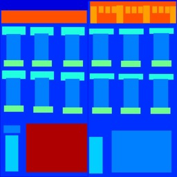
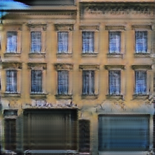

# CycleGAN

["Unpaired Image-to-Image Translation
using Cycle-Consistent Adversarial Networks (aka CycleGAN)"](https://arxiv.org/abs/1703.10593) is an approach of conditional GAN as a solution to image-to-image translation problems when you don't have the paired dataset (<i>unpaired style transfer</i>).

### Some results
Input | Output 
:--: | :--: |
 | 
 | 

If you don't have a dataset you could rather download it by following lines:
<pre><code>wget http://efrosgans.eecs.berkeley.edu/pix2pix/datasets/facades.tar.gz
tar -xvf facades.tar.gz</code></pre>

inspired by [AladdinPersson](https://www.youtube.com/watch?v=5jziBapziYE)

[Sergey Nikolenko](https://scholar.google.com/citations?view_op=view_citation&hl=ru&user=_lk95cEAAAAJ&citation_for_view=_lk95cEAAAAJ:8d8msizDQcsC)
