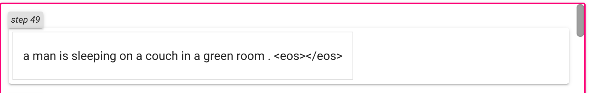

# Seq2Seq

["Sequence to Sequence Learning with Neural Networks (aka Seq2Seq)"](https://arxiv.org/abs/1409.3215) is a method that takes a sequence of items (words, letters, time series, etc) and outputs another sequence of items.

**Note:
I use _torch==1.7.1 torchtext==0.8.0_**

author's BLEU is _34.81_, 
mine - _0.2156_

But I can translate smth:

Source - "ein mann schläft in einem grünen raum auf einem sofa ."

Target - "a man sleeping in a green room on a couch ."

After 50 epochs:

inspired by:
[bentrevett](https://github.com/bentrevett/pytorch-seq2seq)
and
[AladdinPersson](https://www.youtube.com/watch?v=EoGUlvhRYpk&t=1482s&ab_channel=AladdinPersson)