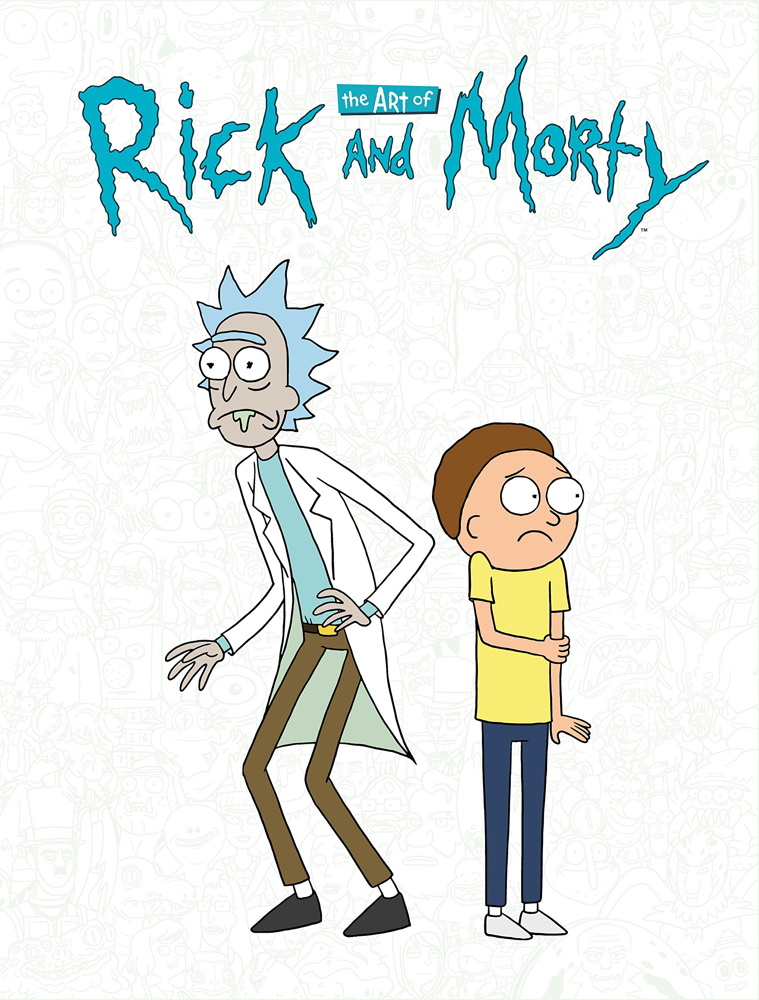
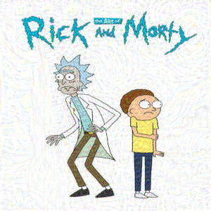
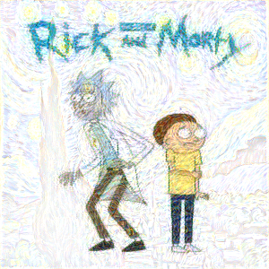
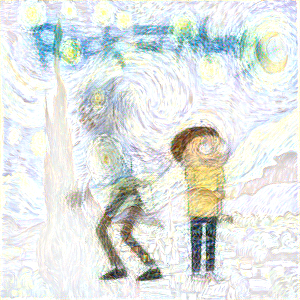

# Neural Style Transfer

["A Neural Algorithm of Artistic Style"](https://arxiv.org/abs/1508.06576) covers an algorithm that combines the content of one image with the style of another image using CNN.

inspired by [Andrew Ng](https://www.youtube.com/watch?v=R39tWYYKNcI&t=0s&ab_channel=DeepLearningAI)

[https://github.com/yunjey/pytorch-tutorial/blob/master/tutorials/03-advanced/neural_style_transfer/](https://github.com/yunjey/pytorch-tutorial/blob/master/tutorials/03-advanced/neural_style_transfer/)

[AladdinPersson](https://www.youtube.com/watch?v=imX4kSKDY7s&ab_channel=AladdinPersson)
